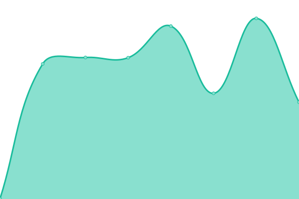
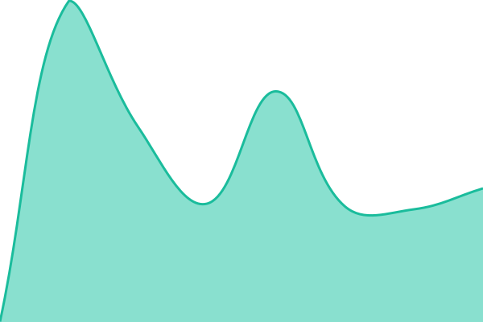
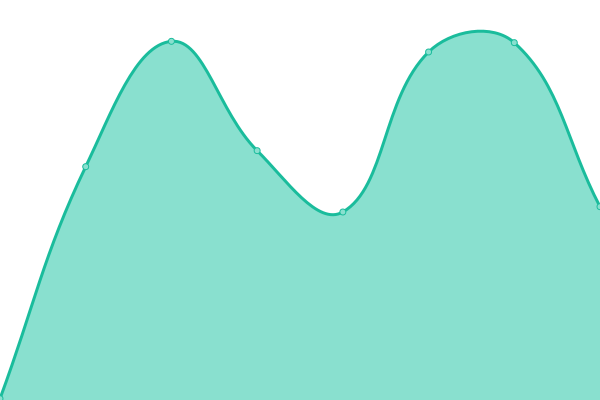
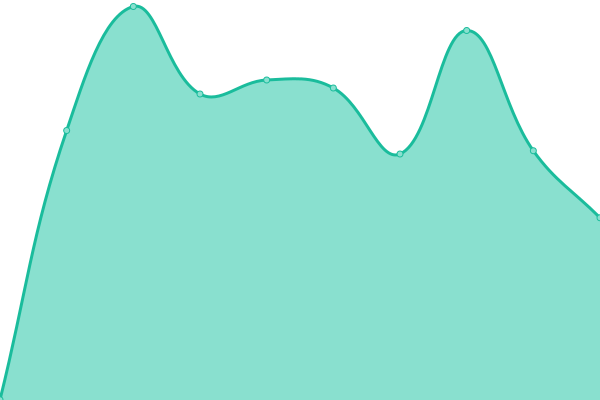

# [📈 Live Status](https://clirdlf.github.io/uptime): <!--live status--> **🟩 All systems operational**

This repository contains the open-source uptime monitor and status page for [CLIR/DLF](http://clir.org), powered by [Upptime](https://github.com/upptime/upptime).

With [Upptime](https://upptime.js.org), you can get your own unlimited and free uptime monitor and status page, powered entirely by a GitHub repository. We use [Issues](https://github.com/clirdlf/uptime/issues) as incident reports, [Actions](https://github.com/clirdlf/uptime/actions) as uptime monitors, and [Pages](https://clirdlf.github.io/uptime) for the status page.

<!--start: status pages-->
<!-- This summary is generated by Upptime (https://github.com/upptime/upptime) -->
<!-- Do not edit this manually, your changes will be overwritten -->
<!-- prettier-ignore -->
| URL | Status | History | Response Time | Uptime |
| --- | ------ | ------- | ------------- | ------ |
|  [CLIR](https://www.clir.org) | 🟩 Up | [clir.yml](https://github.com/clirdlf/uptime/commits/HEAD/history/clir.yml) | 

 1392ms
     
 | 

<a href="https://clirdlf.github.io/uptime/history/clir">99.64%</a>
    

|  [DLF](https://www.diglib.org) | 🟩 Up | [dlf.yml](https://github.com/clirdlf/uptime/commits/HEAD/history/dlf.yml) | 

 1087ms
     
 | 

<a href="https://clirdlf.github.io/uptime/history/dlf">100.00%</a>
    

|  [DLF Wiki](https://wiki.diglib.org) | 🟩 Up | [dlf-wiki.yml](https://github.com/clirdlf/uptime/commits/HEAD/history/dlf-wiki.yml) | 

 539ms
     
 | 

<a href="https://clirdlf.github.io/uptime/history/dlf-wiki">91.50%</a>
    

|  [Jobs](https://jobs.diglib.org) | 🟩 Up | [jobs.yml](https://github.com/clirdlf/uptime/commits/HEAD/history/jobs.yml) | 

 328ms
     
 | 

<a href="https://clirdlf.github.io/uptime/history/jobs">91.50%</a>
    

|  [Hidden Collections Africa](https://hiddencollections.africa) | 🟩 Up | [hidden-collections-africa.yml](https://github.com/clirdlf/uptime/commits/HEAD/history/hidden-collections-africa.yml) | 

 257ms
     
 | 

<a href="https://clirdlf.github.io/uptime/history/hidden-collections-africa">100.00%</a>
    

|  [Climate Resiliency](https://climate-resiliency.clir.org/) | 🟩 Up | [climate-resiliency.yml](https://github.com/clirdlf/uptime/commits/HEAD/history/climate-resiliency.yml) | 

 1234ms
     
 | 

<a href="https://clirdlf.github.io/uptime/history/climate-resiliency">100.00%</a>
    

|  [Digital Conferences Calendar](https://digital-conferences-calendar.info) | 🟩 Up | [digital-conferences-calendar.yml](https://github.com/clirdlf/uptime/commits/HEAD/history/digital-conferences-calendar.yml) | 

 218ms
     
 | 

<a href="https://clirdlf.github.io/uptime/history/digital-conferences-calendar">100.00%</a>
    

|  [Endangered Data Week](https://endangereddataweek.org) | 🟩 Up | [endangered-data-week.yml](https://github.com/clirdlf/uptime/commits/HEAD/history/endangered-data-week.yml) | 

 214ms
     
 | 

<a href="https://clirdlf.github.io/uptime/history/endangered-data-week">100.00%</a>
    

|  [IJA](https://ijarchive.org) | 🟩 Up | [ija.yml](https://github.com/clirdlf/uptime/commits/HEAD/history/ija.yml) | 

 533ms
     
 | 

<a href="https://clirdlf.github.io/uptime/history/ija">100.00%</a>
    

|  [Leading Change Institute](https://leadingchangeinstitute.org) | 🟩 Up | [leading-change-institute.yml](https://github.com/clirdlf/uptime/commits/HEAD/history/leading-change-institute.yml) | 

 1061ms
     
 | 

<a href="https://clirdlf.github.io/uptime/history/leading-change-institute">100.00%</a>
    

|  [NDSA](https://ndsa.org) | 🟩 Up | [ndsa.yml](https://github.com/clirdlf/uptime/commits/HEAD/history/ndsa.yml) | 

 589ms
     
 | 

<a href="https://clirdlf.github.io/uptime/history/ndsa">100.00%</a>
    

|  [Open Repositories](https://www.openrepositories.org/) | 🟩 Up | [open-repositories.yml](https://github.com/clirdlf/uptime/commits/HEAD/history/open-repositories.yml) | 

 679ms
     
 | 

<a href="https://clirdlf.github.io/uptime/history/open-repositories">100.00%</a>
    

<!--end: status pages-->

[**Visit our status website →**](https://clirdlf.github.io/uptime)

## 📄 License

- Powered by: [Upptime](https://github.com/upptime/upptime)
- Code: [MIT](./LICENSE) © [Anand Chowdhary](https://anandchowdhary.com), supported by [Pabio](https://pabio.com)
- Data in the `./history` directory: [Open Database License](https://opendatacommons.org/licenses/odbl/1-0/)
